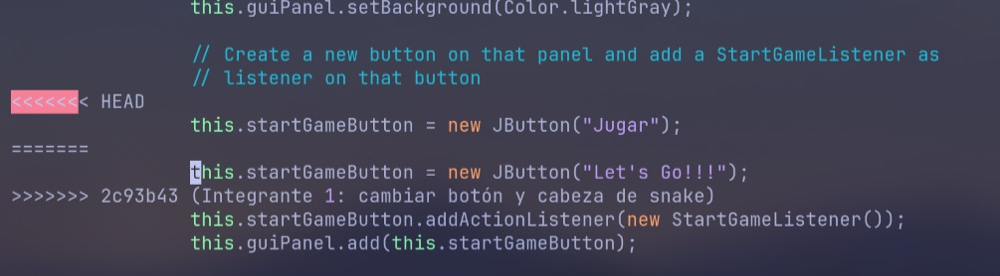
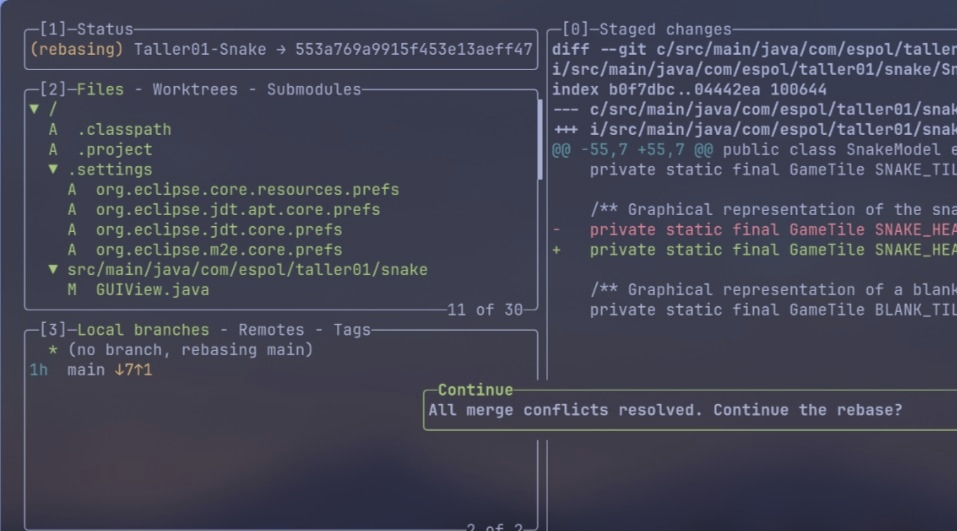
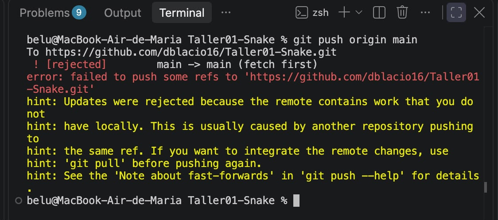

# Taller 01: Git y resolución de conflictos
## Integrantes

Rol - Nombre -Usuario de GitHub
Lider - David Blacio - dblacio16
Integrante 1 - Luke Silva - lxk3btw
Integrante 2 - Maria Llano - belubelu629

## Evidencias

### Lider

Evidencia- del push inicial exitoso desde el GitHub Desktop:

### Integrante 1

Conflicto detectado

Resolución del conflicto

Commit después de resolver el conflicto

### Integrante 2

Push rechazado:

Push final / repositorio sincronizado:
