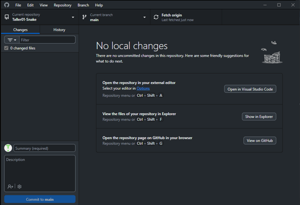
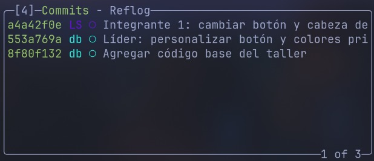
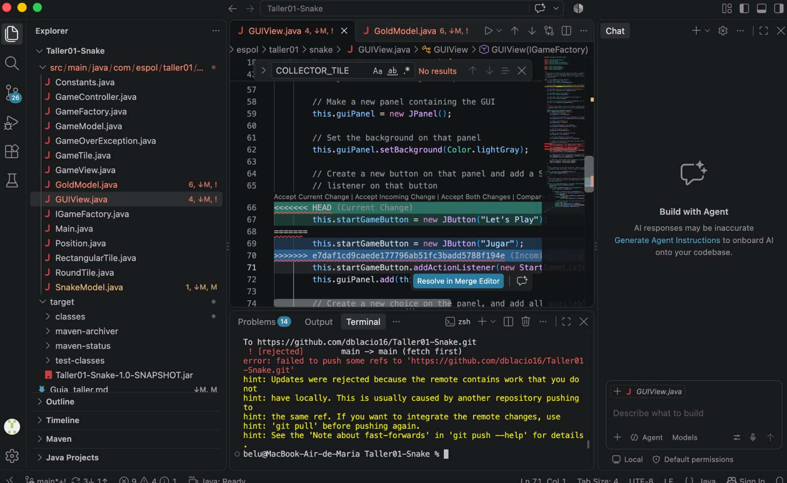
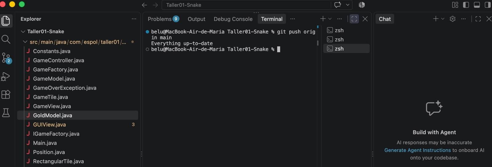

# Taller 01: Git y resolución de conflictos
## Integrantes

| Rol | Nombre | Usuario de GitHub | Commit principal |
| --- | --- | --- | --- |
| Líder|David Blacio|dblacio16| Líder: personalizar botón y colores principales|
| Integrante 1 |Luke Silva  | lxk3btw |Integrante 1: cambiar botón y cabeza de snake  |
| Integrante 2 |Maria Llano  | belubelu629  |Integrante 2: cambiar botón y colector de gold  |

## Evidencias

### Lider

Evidencia del push inicial exitoso desde el GitHub Desktop:

### Integrante 1

Conflicto detectado:

Resolución del conflicto:

Commit después de resolver el conflicto:

### Integrante 2

Conflicto detectado despues del push rechazado:

Push final / repositorio sincronizado:

